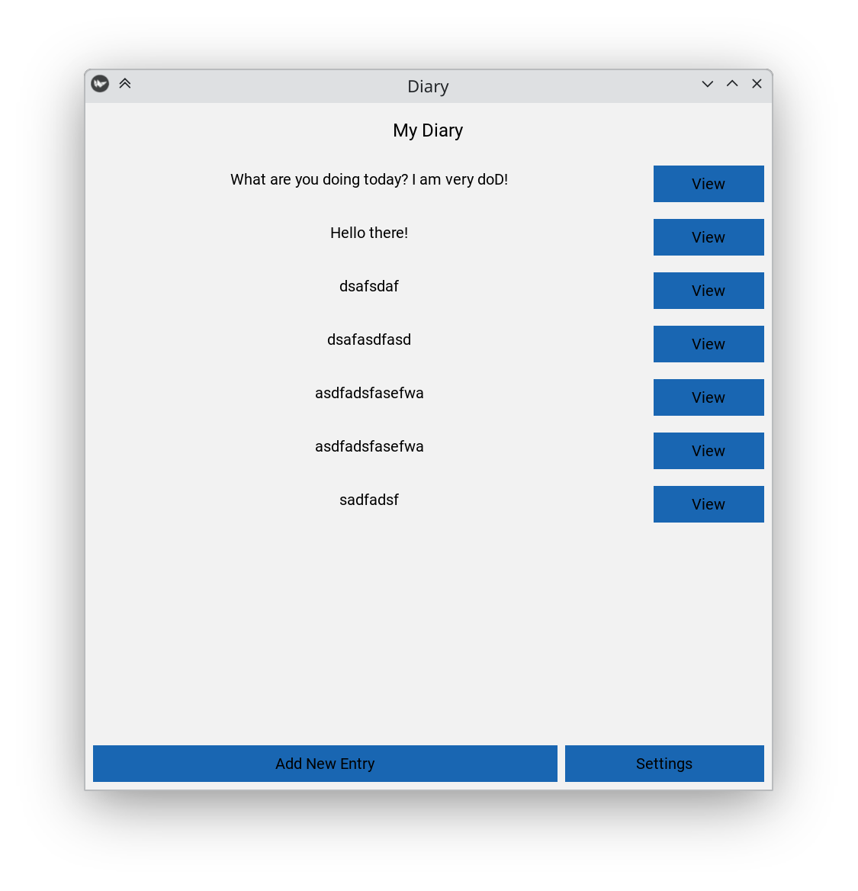
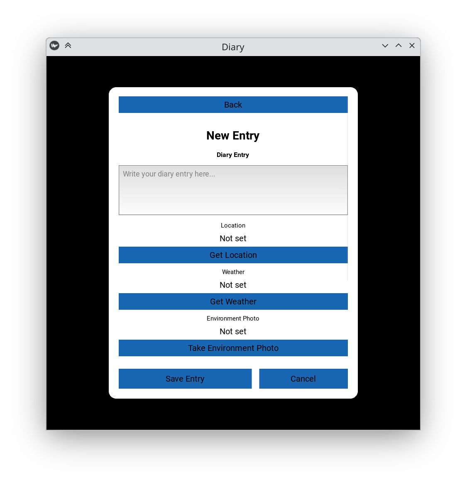
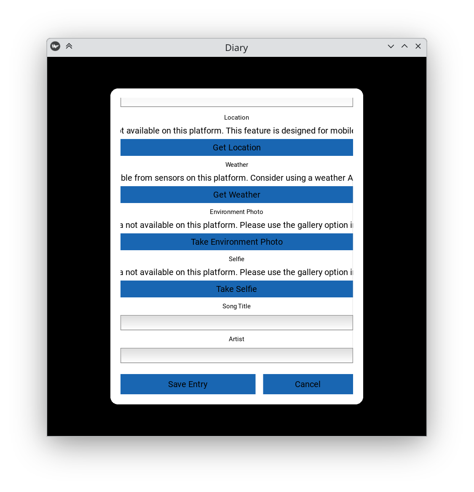
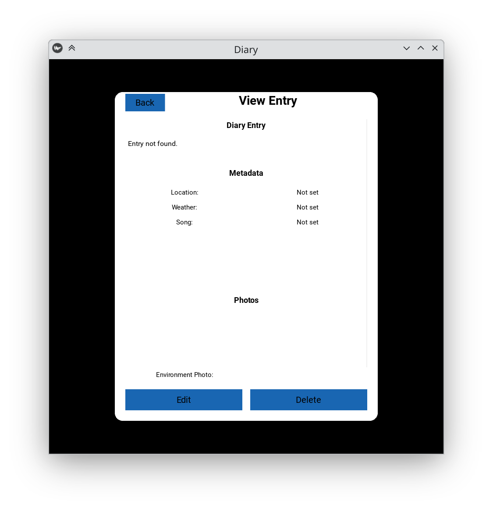
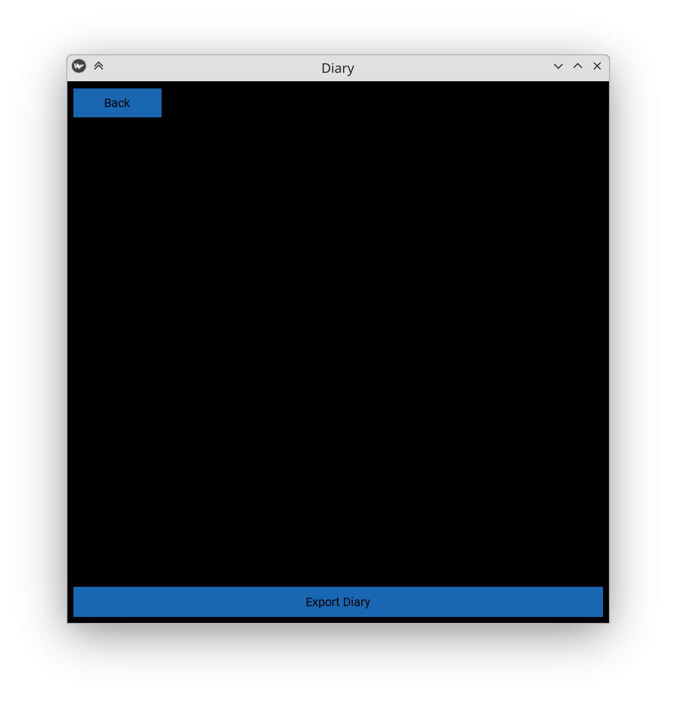

# Diary App User Manual

## Table of Contents
1. [Introduction](#introduction)
2. [Installation](#installation)
3. [Getting Started](#getting-started)
4. [Creating Diary Entries](#creating-diary-entries)
5. [Managing Entries](#managing-entries)
6. [Exporting Your Diary](#exporting-your-diary)
7. [Troubleshooting](#troubleshooting)
8. [Platform-Specific Notes](#platform-specific-notes)

## Introduction

The Diary App is a feature-rich application that allows you to create and maintain a digital diary with rich metadata. Each diary entry can include:
- Text content
- Location data
- Local weather information from device sensors
- Environment photos
- Selfies
- Song of the day

The app is built using Python and Kivy, making it available across multiple platforms while maintaining a consistent user experience.

## Installation

### Windows
1. Ensure Python 3.12 is installed on your system
2. Download the latest release from the project repository
3. Run the installer executable
4. Follow the installation wizard instructions

### macOS
1. Ensure Python 3.12 is installed on your system
2. Download the latest release from the project repository
3. Open the .dmg file
4. Drag the application to your Applications folder

### Linux
1. Ensure Python 3.12 is installed on your system
2. Download the latest release from the project repository
3. Extract the archive to your preferred location
4. Run the application using the provided launcher script

### Android
1. Download the APK from the project repository
2. Enable installation from unknown sources in your device settings
3. Install the APK
4. Launch the app from your app drawer

## Getting Started

### First Launch
1. Launch the application
2. Grant necessary permissions when prompted:
   - Location access
   - Camera access
   - Storage access
   - Sensor access
3. The main screen will display your diary entries (empty on first launch)

### Main Screen Navigation

    

- **New Entry**: Tap the "+" button to create a new diary entry
- **View Entry**: Tap on any existing entry to view its details
- **Settings**: Access settings and export options through the menu button

## Creating Diary Entries

### Basic Entry Creation

    

1. Tap the "+" button on the main screen
2. Enter your diary text in the main text area
3. Add metadata using the buttons below the text area:
   - Location: Tap to capture current location
   - Weather: Tap to record current weather from sensors
   - Environment Photo: Tap to take a photo of your surroundings
   - Selfie: Tap to take a selfie
   - Song of the Day: Enter the title and artist

### Adding Photos

    

1. Tap either the Environment Photo or Selfie button
2. Choose between:
   - Take Photo: Opens the camera
   - Select from Gallery: Opens your device's photo gallery
3. After capturing or selecting, the photo will be attached to your entry

### Saving Entries
1. Tap the "Save" button in the top-right corner
2. Your entry will be saved with all attached metadata
3. You'll be returned to the main screen

## Managing Entries

### Viewing Entries

    

1. Tap any entry on the main screen
2. View all content and metadata:
   - Diary text
   - Location information
   - Weather data
   - Photos
   - Song information

### Editing Entries
1. Open the entry you want to edit
2. Tap the "Edit" button
3. Modify any content or metadata
4. Tap "Save" to update the entry

### Deleting Entries
1. Open the entry you want to delete
2. Tap the "Delete" button
3. Confirm the deletion in the popup dialog

## Exporting Your Diary

    

### Creating an Export Bundle
1. Open the Settings menu
2. Tap "Export Diary"
3. Choose a location to save the export bundle
4. Wait for the export process to complete

### Export Bundle Contents
The exported bundle includes:
- All diary entries in text format
- All associated photos
- A manifest file with metadata
- Location and weather data

### Importing Exports
1. Open the Settings menu
2. Tap "Import Diary"
3. Select your export bundle
4. Confirm the import

## Troubleshooting

### Common Issues

#### Location Not Working
- Ensure location services are enabled on your device
- Check app permissions
- Try moving to an area with better GPS signal

#### Camera Issues
- Verify camera permissions are granted
- Ensure sufficient storage space
- Check if another app is using the camera

#### Weather Data Not Available
- Ensure sensor permissions are granted
- Check if your device has the required sensors
- Try restarting the app

#### Export/Import Problems
- Ensure sufficient storage space
- Check file permissions
- Verify the export bundle is not corrupted

## Platform-Specific Notes

### Windows
- Requires Windows 10 or later
- Minimum 4GB RAM recommended
- 500MB free storage space required

### macOS
- Requires macOS 10.15 or later
- Minimum 4GB RAM recommended
- 500MB free storage space required

### Linux
- Tested on Ubuntu 20.04 and later
- Minimum 4GB RAM recommended
- 500MB free storage space required

### Android
- Requires Android 8.0 or later
- Minimum 2GB RAM recommended
- 100MB free storage space required
- Some features may be limited based on device capabilities

## Acknowledgments

We would like to express our gratitude to the following open-source projects and tools that made this application possible:

### Core Technologies
- **Python 3.12**: The programming language that powers our application
- **Kivy Framework**: For cross-platform UI development
- **Plyer**: For accessing device features like camera, GPS, and sensors

### Development Tools
- **Buildozer**: For Android application packaging
- **PyInstaller**: For desktop application packaging
- **SQLite**: For local data storage
- **Pillow**: For image processing
- **Pandoc**: For documentation generation

### Testing and Quality Assurance
- **pytest**: For unit testing
- **Kivy's Test Suite**: For UI testing
- **Git**: For version control

## References

### Documentation
1. Kivy Documentation: https://kivy.org/doc/stable/
2. Python Documentation: https://docs.python.org/3.12/
3. Plyer Documentation: https://plyer.readthedocs.io/
4. Buildozer Documentation: https://buildozer.readthedocs.io/

### Technical Resources
1. SQLite Documentation: https://www.sqlite.org/docs.html
2. Pillow Documentation: https://pillow.readthedocs.io/
3. PyInstaller Documentation: https://pyinstaller.org/

### Community Support
- Kivy Forum: https://kivy.org/#forum
- Python Community: https://www.python.org/community/
- Stack Overflow: https://stackoverflow.com/

---

For additional support or to report issues, please visit our project repository or contact the development team. 